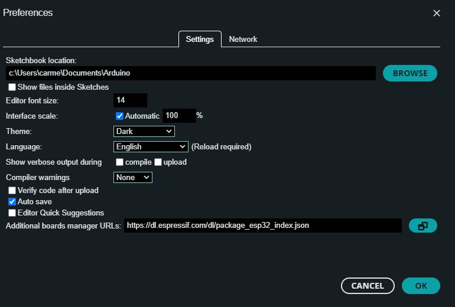
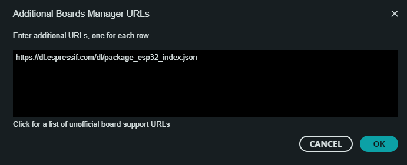

# Progetto-5-SOD
## ESP32
### Installazione di ArduinoIDE
### Configurazione dell'ESP32 su ArduinoIDE
   * Inserire all’interno del menu Preferenze nella voce 'Additional Board manager' il seguente link di configurazione dell’ESP32: https://dl.espressif.com/dl/package_esp32_index.json
     
     
   * Installare tutti i pacchetti relativi all’ESP3 all’interno dell’IDE di Arduino. Per far questo `e necessario, dalla schermata principale del software, andare sotto la     voce Tools, selezionare Board: "ESP32-WROOM-DA Module" e infine andare all’interno di Board Manager.
   * Selezionare la dicitura Board Manager all’interno della quale si dovrà ricercare ESP32 e installare il pacchetto corrispondente.
   * Una volta installato l’ambiente è necessario configurare la scheda per poter eseguire gli sketch realizzati. Per fare questo è necessario, all’intero della scheda Tools, selezionare la board che si sta effettivamente utilizzando. La board utilizzata in questo progetto è l’ESP32-WROOM-DA Module.
   * Come ultima cosa è necessario settare la porta COM alla quale la scheda ESP32 è collegata sul computer. Per far questo, sempre sotto il menu Tools, è necessario selezionare la voce COM e impostare la porta desiderata.
### Installazione Librerie per l'ESP32 tramite ArduinoIDE
Per poter utilizzare i sensori tramite ESP32 è necessario installare le seguenti librerie:
  * RTClib
  * Wire
  * SPI
  * Adafruit_BMP280
  * BH1750
    
Per l'utilizzo del Bluetooth Low Energy bisogna installare la libreria:
  * BluetoothSerial
    
Per la gestione dei task tramite freeRTOS è necessario installare la libreria:
  * freertos

## Raspberry Pi
### Installazione librerie Raspberry Pi 
Per implementare la comunicazione bluetooth tra la Raspberry e l'ESP32 è necessario installare sulla RPi la libreria PYBluez da terminale tramite il seguente comando:

`sudo pip install pybluez`

Per poter realizzare un client MQTT tramite RPi si deve installare la libreria paho tramite il seguente comando:

`sudo pip install paho-mqtt`

## Virtual Machine - Linux
### Installazione di Mosquitto su Linux e creazione del Broker MQTT
Per poter creare un Broker MQTT è necessario installare la libreria Mosquitto tramite il comando: 

`sudo apt-get install mosquitto`

Fatto questo il Broker viene avviato con il comando:

`sudo service mosquitto start`

### Installazione della libreria Flask
Per la creazione di una pagina web tramite python è necessario installare la libreria Flask utilizzando il comando:

`python3 pip install flask`

### Installazione della libreria sqlite3
Per realizzare un database tramite python è possibile utilizzare la libreria sqlite3 (se non già integrata) che si installa con il comando:

`pip install pysqlite3`

   

